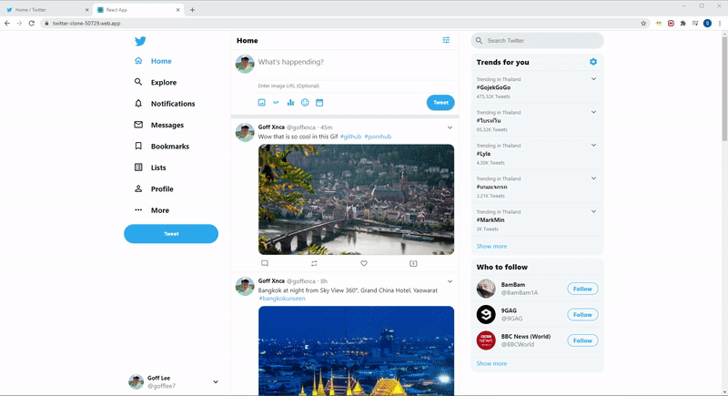

# React Twitter clone

## Project Description

The objective of this project is to build a React Twitter clone with the following features:

- Post a tweet message with Image URL
- List all the tweet messages
- Hashtag support
- Add a nice smooth Flex move animation when the list of tweet message changed.
- Show 'Trend for you' and 'Who to follow' section
- Full Responsive features fit to all screen size

## 🖼️ Screenshot

## 🌐 [Live Preview](https://twitter-clone-50729.web.app/)

## 🛠️ Tech stack

In this project I used:

- React 16.3.1
- HTML5 and CSS3
- MaterialUI
- Firebase (for hosting & realtime data store)
- React Flex Move

## 🧾 TODO

- Retrive dynamic trends, tweets post, who to follow from twitter API

## 🤝 Contributing

Contributions, issues and feature requests are welcome!

Feel free to check the [issues page](../../issues).

## ⭐️ Show your support

Give a ⭐️ if you like this project!

## 👨🏽‍💻 Authors

- [@goffxnca](https://github.com/goffxnca/)

## 📝 License

[MIT licensed](./LICENSE).
